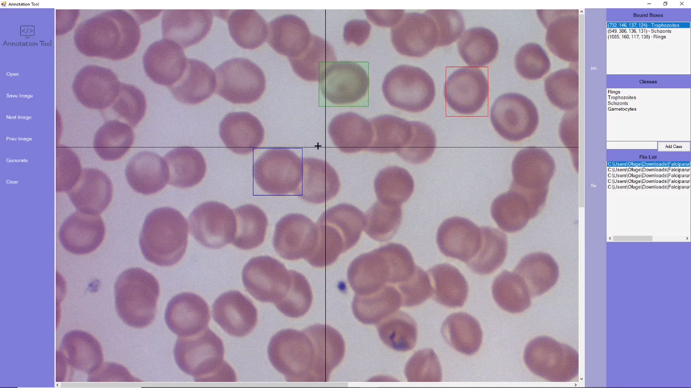
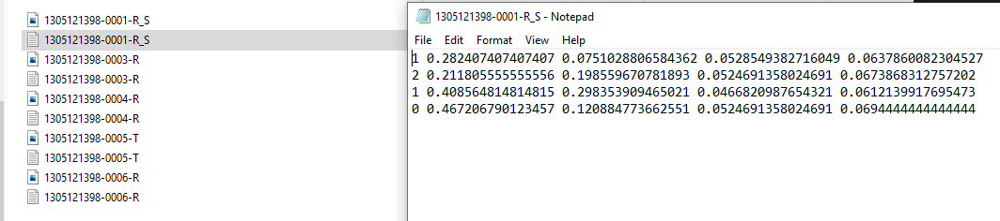

# Annotation Tool
This is the implementation of a graphical image labeling tool that allows users to import, view, correct annotations and generate annotations based on a format such as YOLO Format.   

Saved YOLO Annotated Files

### Features
* Add, Select and Delete Bound Boxes
* Load Annotated Files using AT Format
* Save Annotation Files in AT Format
* Supported Annotation Format
  * YOLO Format

## Author
* **Jamiu Oluwaseun Ojeleye**
